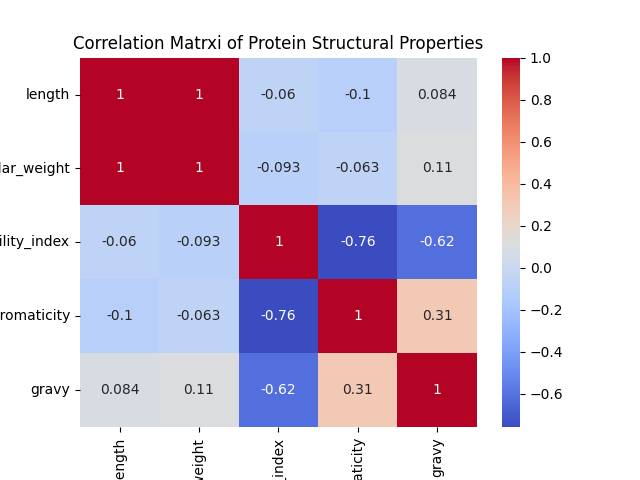
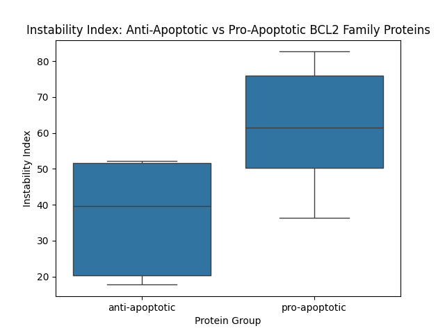
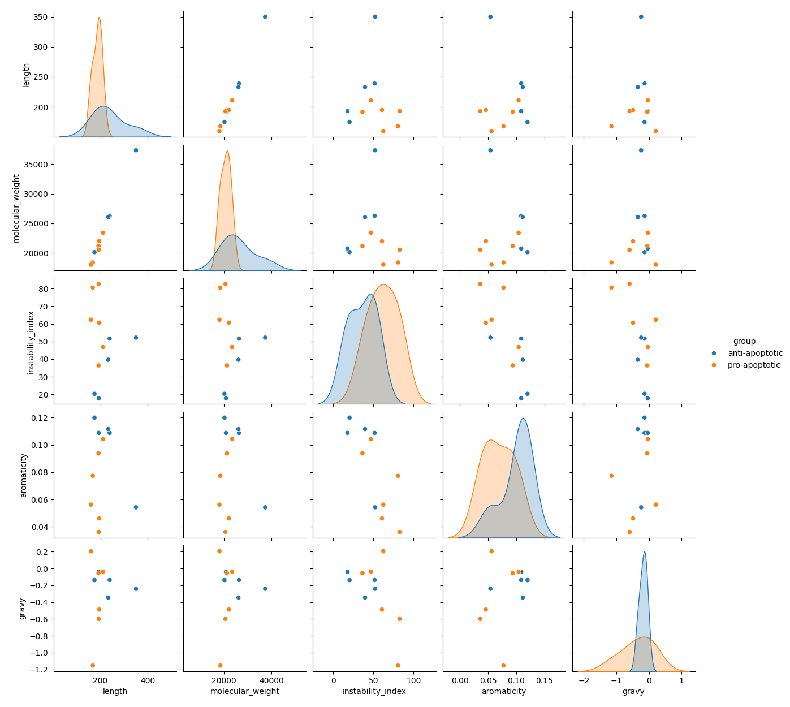

# Protein Structure Data Analysis — BCL2 Family

## Overview
This project analyzes structural properties of 11 BCL2-family apoptosis 
proteins (5 anti-apoptotic, 6 pro-apoptotic), using data fetched directly 
from UniProt. It builds on my previous projects — [Project 1: DNA Sequence 
Analyzer] and [Project 2: Gene Expression Analyzer] — extending my Python 
and bioinformatics skills into protein-level structural analysis and 
statistical visualization with Seaborn.

## Biological Context
BCL2-family proteins regulate apoptosis (programmed cell death) and are 
frequently dysregulated in cancer. This project's protein selection and 
analysis approach was directly informed by my research on BCL2-mediated 
apoptotic pathway genes in invasive breast carcinoma using TCGA data.

## Proteins Studied
**Anti-apoptotic (5):** BCL2, BCL2L1, MCL1, BCL2A1, BCL2L2
**Pro-apoptotic (6):** BAX, BAK1, BID, BAD, BIK, BBC3

## Workflow
1. Verified UniProt accession numbers for all 11 proteins
2. Fetched amino acid sequences programmatically via UniProt's REST API
3. Calculated structural properties (molecular weight, instability index, 
   aromaticity, GRAVY score) using Biopython's ProtParam module
4. Visualized distributions, group comparisons, relationships, and 
   correlations using Seaborn
5. Applied Mann-Whitney U testing to assess statistical significance of 
   group differences

## Key Findings
- **Length and molecular weight are almost perfectly correlated (r=0.996)** 
  — a sanity-check confirming data integrity
- **Aromaticity and instability index are strongly negatively correlated 
  (r=-0.76)** — more aromatic proteins tend to be more stable, consistent 
  with known stabilizing interactions of aromatic residues in folded structures
- **Pro-apoptotic proteins showed a higher median instability index** than 
  anti-apoptotic proteins, though this difference did not reach statistical 
  significance (Mann-Whitney p=0.082) — likely due to the small sample size (n=11)
- **MCL1 is a consistent structural outlier** in size across multiple plots, 
  while still following the same length-weight relationship as other family members

## Sample Results

### Correlation Heatmap

### Group Comparison — Instability Index

### Pairplot — All Properties

## Tools Used
- Python (Pandas, NumPy, requests)
- Biopython (SeqIO, ProtParam)
- Seaborn / Matplotlib
- SciPy (Mann-Whitney U test)

## Repository Structure
- `data/` — protein list, fetched sequences (FASTA), calculated properties (CSV)
- `scripts/` — analysis and plotting scripts
- `results/` — generated figures (histograms, boxplots, violin plots, 
  scatterplots, heatmap, pairplot)

## Status
✅ Complete
